# EasySave

## Presentation

Our team has just joined the software publisher ProSoft. Under the responsibility of the CIO, we'll be in charge of managing the EasySave project which consists in developing a backup program.

**How to install the application ?**

To install the application, you simply need to clone the repository. All necessary files will be included, all you have to do is launch the executable file.
User documentation is available to understand how the application works, especially to guide you through the main menu. It has been made so that the application is as user-friendly as possible.

## Version 1.1

### Flow diagram:

### Sequence diagrams

#### Software actions:

Show jobs:

Create a job:

Delete a job:

Modify a job:

#### Software settings

Set default settings:

### Activity diagram

### Usecase diagram

### Class diagram

**How to install the application ?**

To install the application, you simply need to clone the repository. All files will be included, all you have to do is launch the executable file.

**LATEST RELEASE**

- Ability to backup folders and files
- Ability to change application settings
- Ability to create and view a backup job
- Log files in JSON

**UPCOMING FEATURES**

- Graphics application
- Log files in XML
- Unlimited number of backup jobs
- Backup encryption
- Evolution of log files
- Business software

User documentation is available to understand how the application works, especially to guide you through the main menu. It has been made so that the application is as user-friendly as possible.

## Version 2.0

### Sequence diagrams

#### Software actions:

Save a job:

Save all jobs:

#### Software settings:

Set display:

Set language:

Show logs:

### Activity diagrams

General activity diagram:

Job activity diagram:

Settings activity diagram:

### Usecase diagram

### Class diagram

### Component diagram

**LATEST RELEASE**

- Graphical application
- Log files in XML
- Unlimited number of backup jobs
- Backup encryption

**UPCOMING FEATURES**

- Thread synchronisation
- Progress bar

## Version 3.0

### Flow diagram:

### Sequence diagrams

#### Software actions:

Make an instant save:

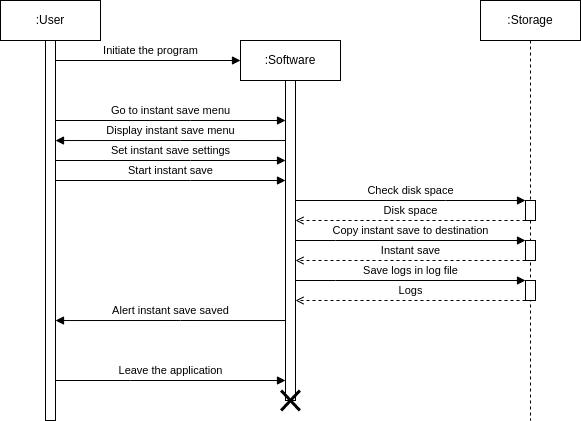

Create a job:

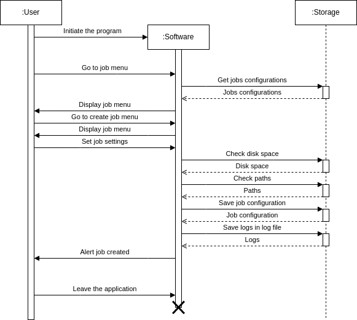

Modify a job:

Delete a job:

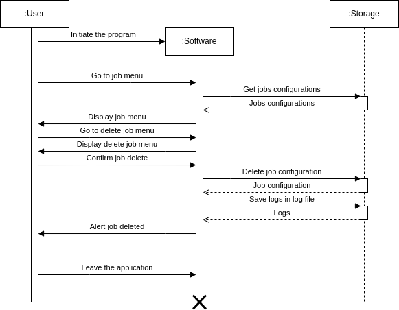

Save a job:

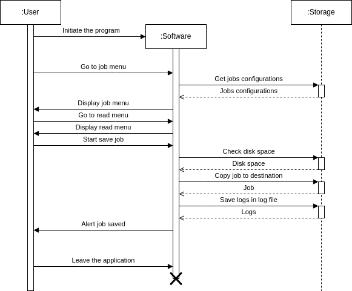

Save all jobs:

Save selected jobs:

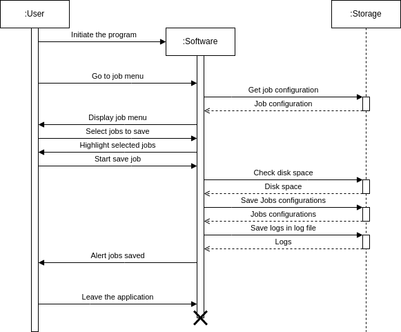

#### Software settings:

Change default destination path:

Change language:

Change extension type:

Change business software process list:

Change encryption extension list:

Change maximum file size:

Change priority software extensions list:

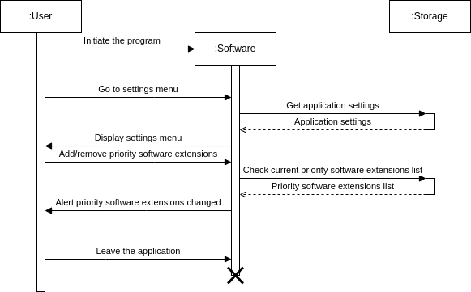

#### Software remote:

Remote use:

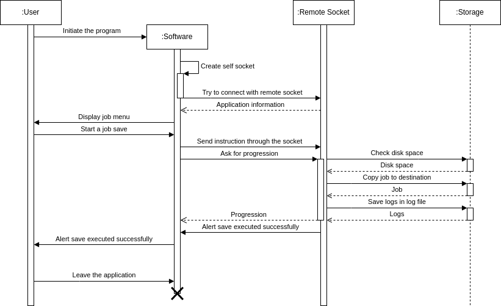

### Usecase diagram

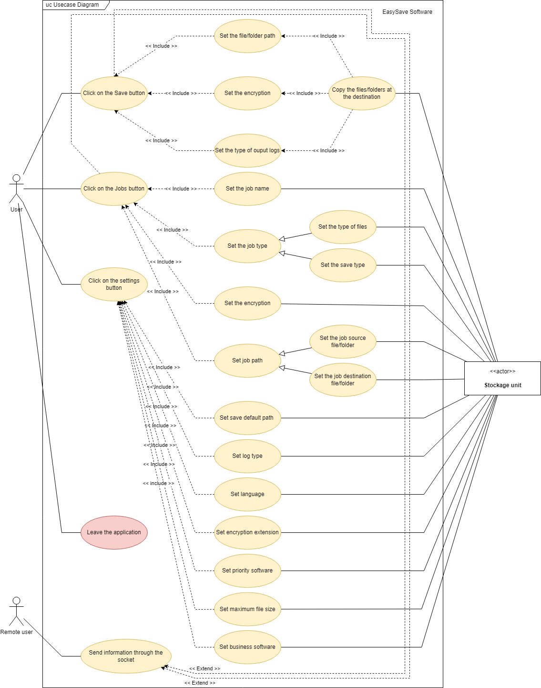

### Activity diagrams

General:

#### Software actions:

Instant save:

Create a job:

Modify a job:

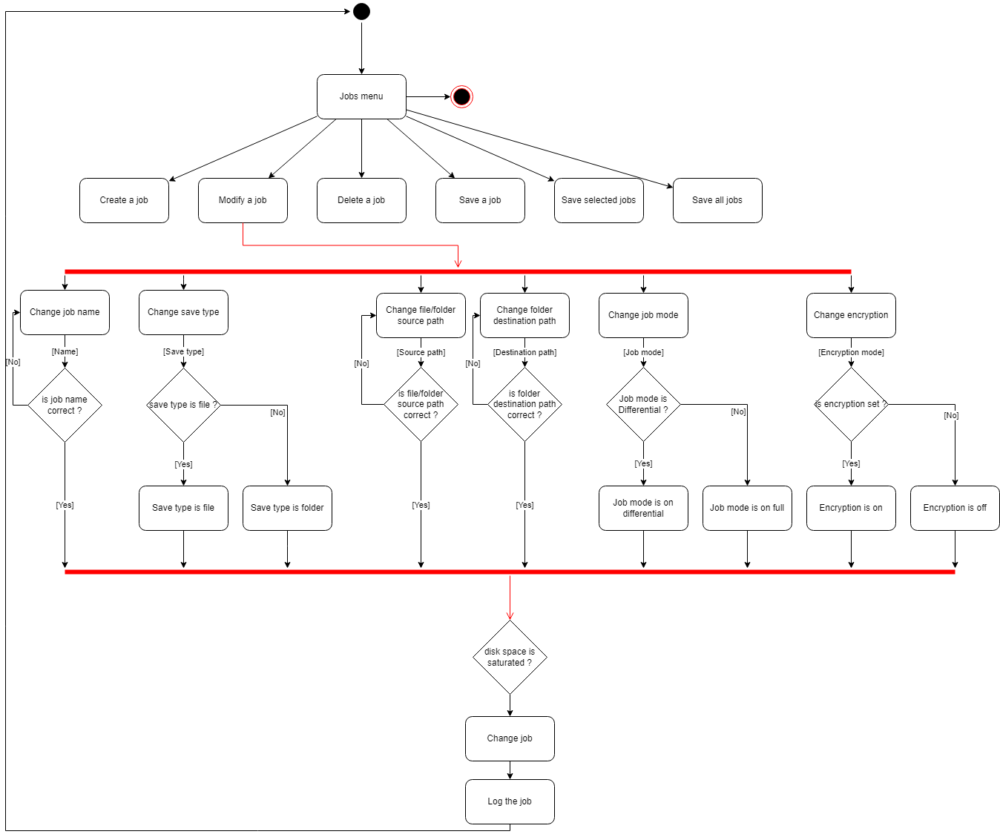

Delete a job:

Save a job:

Save selected jobs:

Save all jobs:

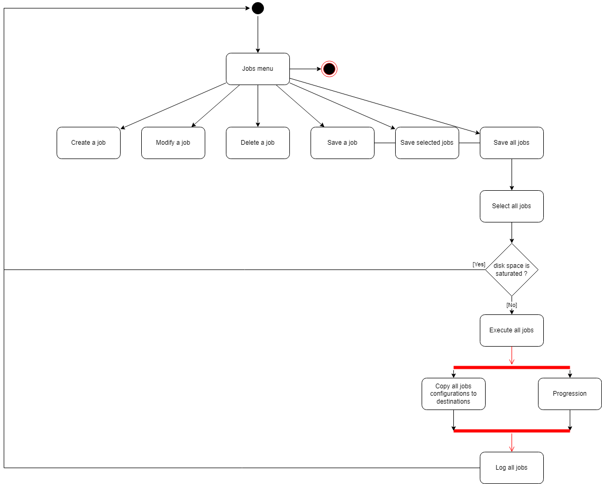

#### Software settings:

Change language:

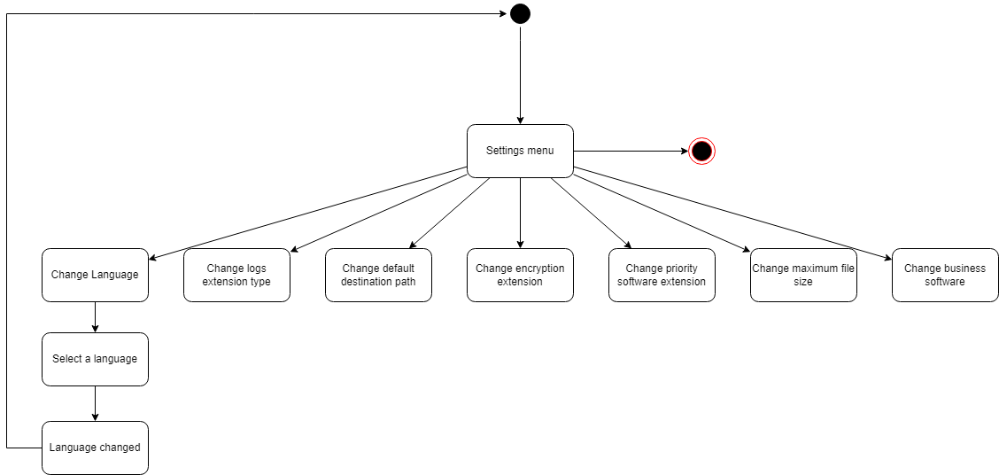

Change logs extension type:

Change default destination path:

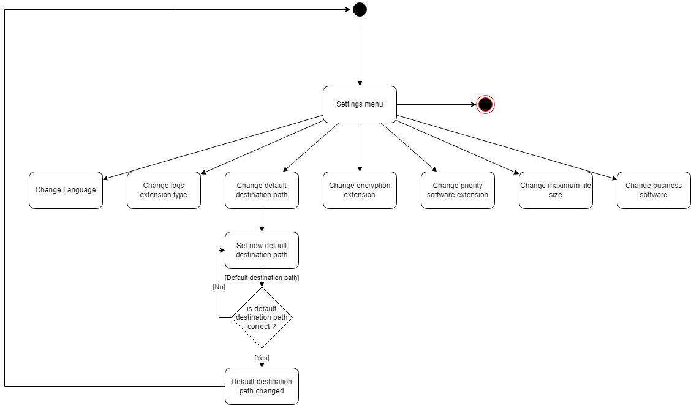

Change encryption extension:

Change priority software extension:

Change maximum file size:

Change business software:

### Compnent diagram

